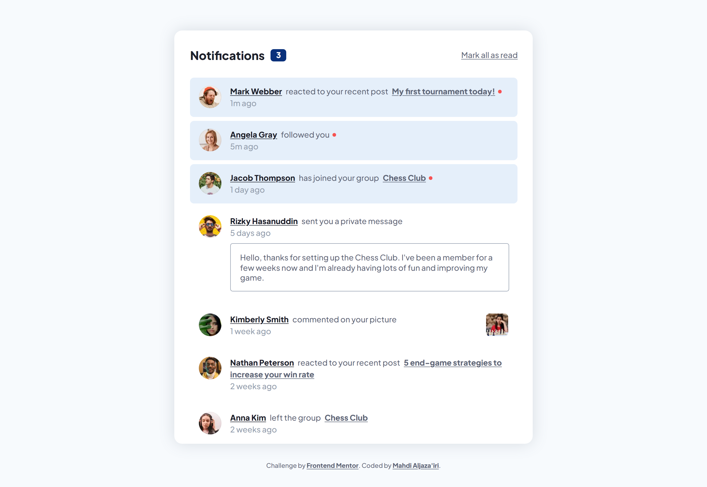

# Frontend Mentor - Notifications Page Solution

This is a solution to the [Notifications page challenge on Frontend Mentor](https://www.frontendmentor.io/challenges/notifications-page-DqK5QAmKbC).  
Frontend Mentor challenges help you improve your coding skills by building realistic projects. 

\*Me\* : I agree 👍

## Table of Contents

- [Overview](#overview)
  - [The Challenge](#the-challenge)
  - [Screenshot](#screenshot)
  - [Links](#links)
- [My Process](#my-process)
  - [Nuclear Reactions All Over The Place!](#nuclear-reactions-all-over-the-place)
  - [Design Note](#design-note)
  - [What I Learned](#what-i-learned)
  - [Continued Development](#continued-development)
- [Tools](#tools)
- [Author](#author)

## Overview

### The Challenge

Users should be able to:

- Distinguish between "unread" and "read" notifications
- Select "Mark all as read" to toggle the visual state of the unread notifications and set the number of unread messages to zero
- View the optimal layout for the interface depending on their device's screen size
- See hover and focus states for all interactive elements on the page

### Screenshot

### Links

- Solution URL: <https://your-solution-url.com>
- Live Site URL: <https://your-live-site-url.com>

## My Process

### Nuclear Reactions All Over The Place!

This is my first project built with React. And I think I did a great job!  
It wasn't as hard as I thought, though.

I made three component types:

- `NotifMain`, for the main component that holds the state of the number of unread notifications.
- `NotifHeader`, for the header. The only actual reason why it was isolated from `NotifMain` is to reduce the crowded-ness (to some extent).
- `Notif`, for the notifications. Where goes most of the work.

One thing you might notice is that there is a file named `data.json` which didn't originally exist in the starter kit. If we're using React to build the page markup programatically, it wouldn't make sense to hard-code the content of the notifications. This kills the purpose of using React in the first place! So, and since the raw data wasn't provided by the Frontend Mentor team, I decided to create my own "artificial" JSON file. I even picked randomized numbers for the `elapsedTime` of each notification --which will yet result in the same output, eventually-- just to make it somewhat more realistic.

In the `Notif` function, I managed to write the most efficient code I could write to automatically assemble the text inside each notification depending on the `actionType` and `targetType`. It was just a matter of recognizing the pattern the text should follow, and then applying that pattern in the code.

Also, I added a little extra detail. A number in parentheses in the page's title representing the number of unread notifications. A feature that exists in all kinds of social --and non-social-- web apps to give you a little hint in the tab name that there's something new!

### Design Note

I don't consider myself to be a master at web design --otherwise I should've made my own designs for my projects. But, there are some things that are obvious even for the dumbest.

If you remove underlines from anchors (aka, `<a>` tags), which will strip away the very sign that a piece of text is a link, you have to give them some other sort of distinction to let them stick out. A shift in color or change of the cursor shape upon hover is not enough since the user needs to know that something can be interacted with before they do interact with it.

The only --hardly noticeable-- distinction made in the original design between links and non-links is that links are bold. This is bad design. We need our websites to be accessible by most users even if they have low vision conditions. Plus, boldness is not an evident indication that you can interact with text.

I didn't want to break the color system by giving anchors a strong color. Therefore, I kept the underlines, making it easy for everyone to see for clear what is a link, and what isn't.

### What I Learned

**Nothing.**

Kidding 😁. Of course the most important thing I learned is how to build a web page with React. Still, I got to dive deeper in the documentation and tutorials inorder to properly utilize this library and bring out its real powers!

In addition, I happened to discover an interesting CSS feature while working on this project. First, I noticed that the links looked kinda cluttered and unattractive because the underline was too close to the text baseline. My initial solution was to play with the `text-underline-offset` until I find a suitable value. Then, I somehow found out that if I set `text-underline-position` to `from-font` the browser will put the underline in the perfect place depending on info from the font file. So I didn't need to choose the place of the underline manually through `text-underline-offset`.

When I first read about `text-underline-position`, I thought it only had an effect on vertical text to put the underline either to the right or to the left. But it turns out it can also determine the **offset** of the underline in horizontal writing mode depending on the font. This is especially useful since it works for most fonts. Whereas if you used `text-underline-offset`, you'd have to set a custom-tailored offset whenever you have an element with a different font-family, or when the designer arbitrarily decides to change the typeface of the website.

### Continued Development

As mentioned above, I need to read about and experiment with more advanced features of the React library. And learn more about accessibility stuff as well.

## Tools

- [Dev Docs](https://devdocs.io) - The resource I was constantly referring to throughout the process. It's an offline web app that has a huge collection of documentations.
- [Brackets](https://brackets.io) - My text editor. Not as powerful as VS Code, but still my favorite.
- Chrome - This web page was only tested on Chrome. 

## Author

- GitHub - [Mahdi Aljaza'iri](https://github.com/MahdiAljazairi)
- Frontend Mentor - [@MahdiAljazairi](https://www.frontendmentor.io/profile/MahdiAljazairi)
